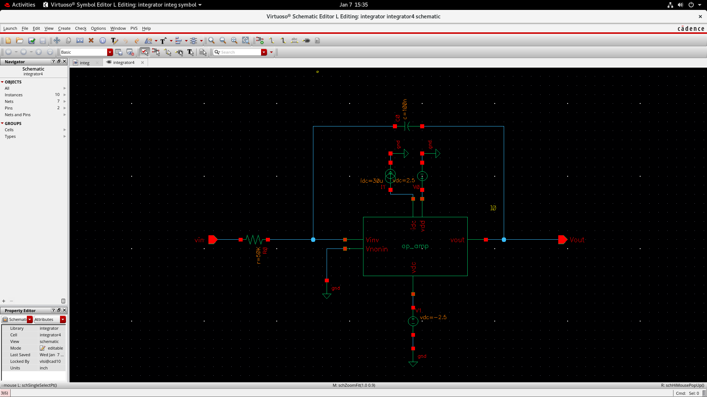
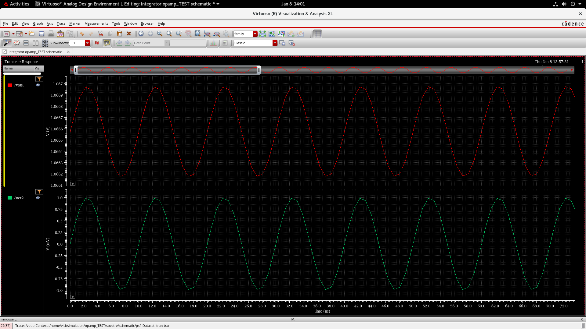

# CMOS Integrator – Cadence Virtuoso

This repository contains the design and simulation of a **CMOS integrator**
implemented using **Cadence Virtuoso**. The integrator is designed as a
fundamental building block for a **Sigma–Delta Modulator**.

## Tool Used
- Cadence Virtuoso (Analog Design Environment)

## Library Name
- integrator

## Cells Included
- **int** : CMOS integrator schematic and symbol  
- **int_tb** : Integrator testbench  
- **int_test** : Top-level transient and AC simulation  

## Simulations
- Transient analysis to verify integration behavior  
- AC analysis to verify frequency response  
- Input: Sinusoidal signal  
- Output: Integrated (ramp/filtered) waveform  

## Integrator Schematic
The CMOS integrator schematic designed using Cadence Virtuoso.

## Integrator Symbol / Testbench
Testbench used to verify the integrator operation.

## Simulation Results
Transient simulation results of the CMOS integrator.

## Transient and AC Analysis
Transient response and AC frequency response of the integrator.

## Tools Used
- Cadence Virtuoso (Analog Design Environment)
- Spectre Simulator

## Project Team
This project was carried out as a **group mini-project**.

### Team Members
- Likhith Gowda H R  
- Dhruthi Sridhar  
- Adith Soragu  
